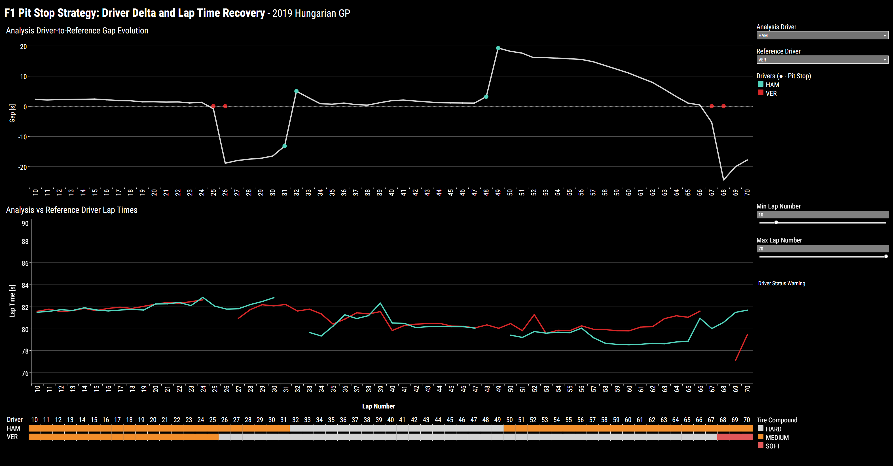
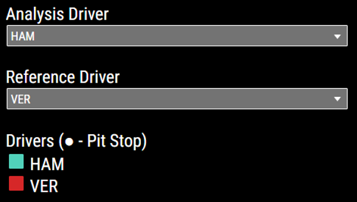
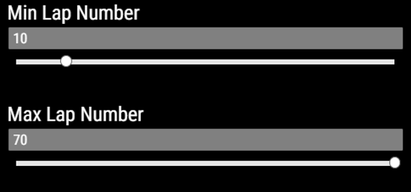
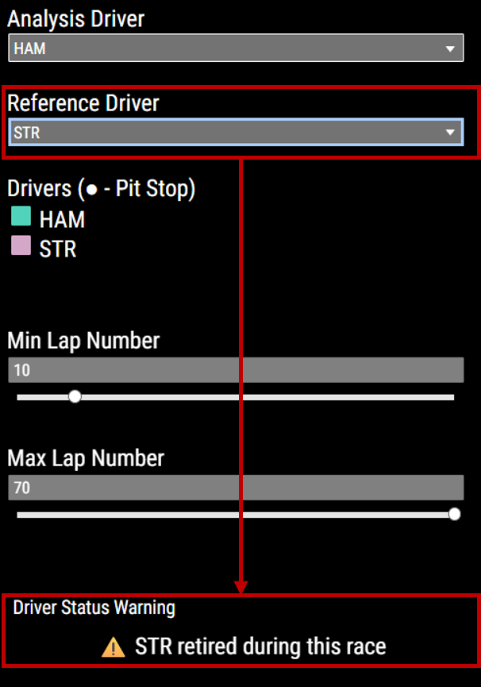
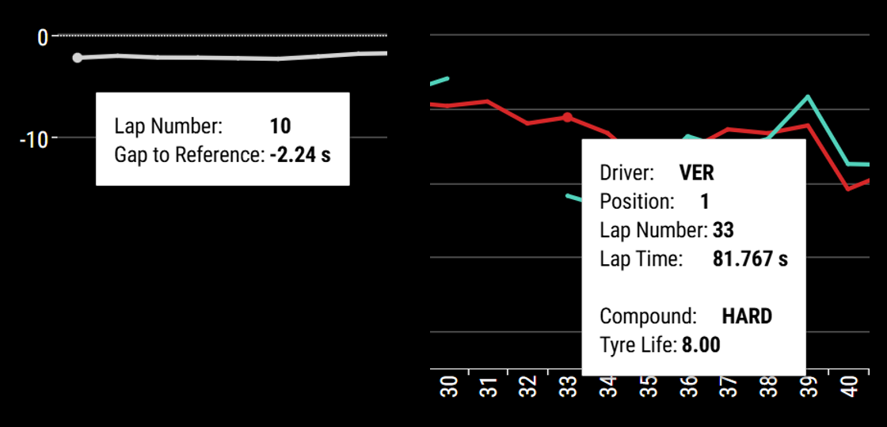
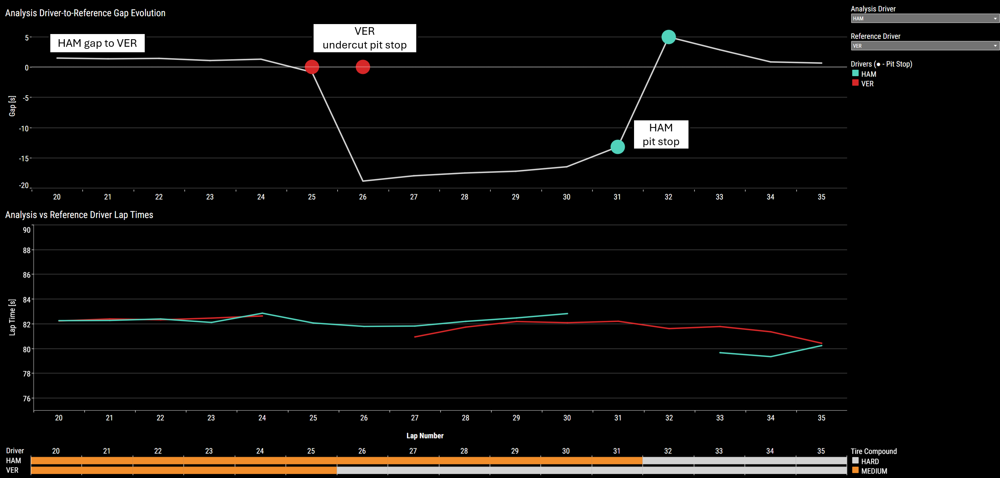
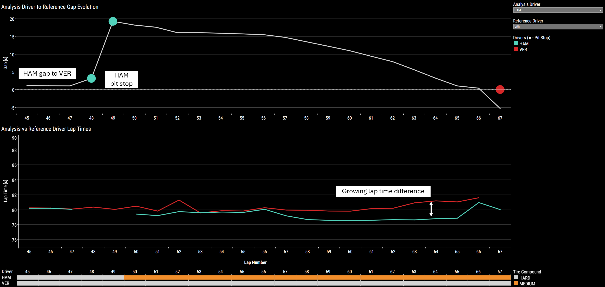
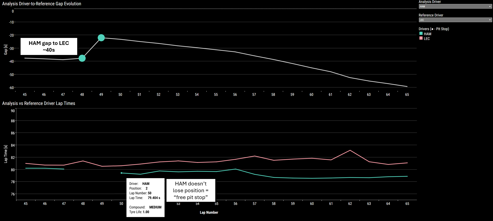

# f1_dash 🏎️

A dashboard for analyzing pit stop strategy in Formula 1 racing sessions. This project serves as a learning exercise for using Tableau to make interactive self-serve dashboards.

Interactive dashboard online at: https://public.tableau.com/app/profile/daniel.lu8478/viz/Formula1RacingPitStopGapRecoveryData/PitStopAnalysisDashboard

## Data Visualizations

The dashboard is configured for a user to look at pit stop strategy after a racing session is complete, looking at plots that compare gaps between and lap times of two drivers, analysis driver and reference driver.

- **Analysis Driver-to-Reference Gap Evolution**: Plot shows gap between drivers at the end of each lap. Negative gap means analysis driver is ahead of reference driver.
- **Analysis vs Reference Driver Lap Times**: Plot shows lap times for each driver.
- **Tire Compound**: Supplemental chart showing tire compound used by each driver during every lap.

## Usage

| Step |  Menu |
|:------|----:|
| 1. The user selects analysis and reference driver on the dropdown menus on the top right. Both plots will update to show the corresponding driver delta, lap times, and tire compounds.|   |
| 2. The user can also zoom in/out by specifying the min and max lap numbers  |   |  
| 3. A warning will be displayed if any issues were encountered during the racing session that may cause misleading values in the data (e.g., driver retired early or analysis driver lapped reference driver)  |   |  
| 4. Mouse hover over data points in the plots reveals tool tips with lap-specific info.  |   |  

## Case Study

A demo of this dashboard looks at Lewis Hamilton's victory of Max Verstappen in the 2019 Hungarian Grand Prix.

Hamilton (HAM) starts the race at P3 behind Verstappen (VER) in P1 and gets to P2 by the end of Lap 1. At Lap 25, Verstappen undercuts with an early pit stop and regains P1 during Hamilton's pit stop.

At Lap 48, Hamilton makes another pit stop. Hamilton's team had not planned for two pit stops before the race but [decided](https://youtu.be/onWe3EeKBtc?si=aHlEG8lCghvojk8x&t=153) that a switch back to medium tires would help force Verstappen to stay out on hard tires and close the gap when Verstappen's tires' condition diminished.

After the second pit stop, Hamilton consistently achieved faster lap times than Verstappen. By Lap 67, Hamilton had closed the initial 20s gap and overtakes Verstappen to eventually finish the race in P1.

Hamilton's second pit stop was also considered a "free pit stop" due to his significant 40s gap ahead of rival driver Charles LeClerc (LEC) in P3, resulting in no loss in racing position. This can be seen when switching the reference driver from VER to LEC.

